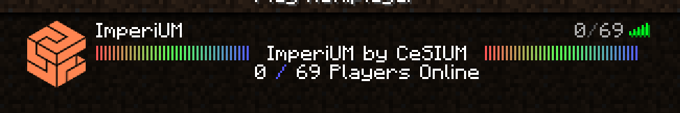
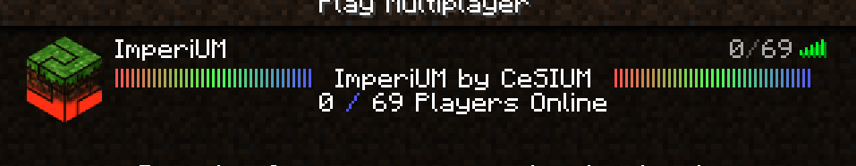
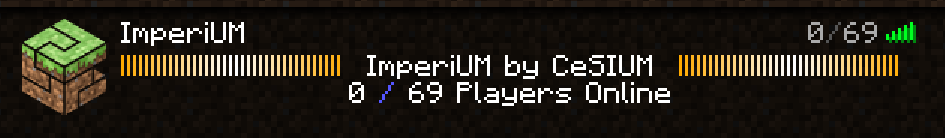
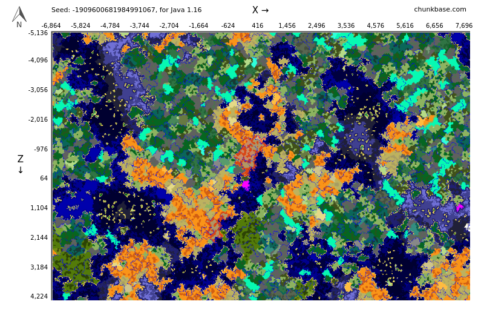
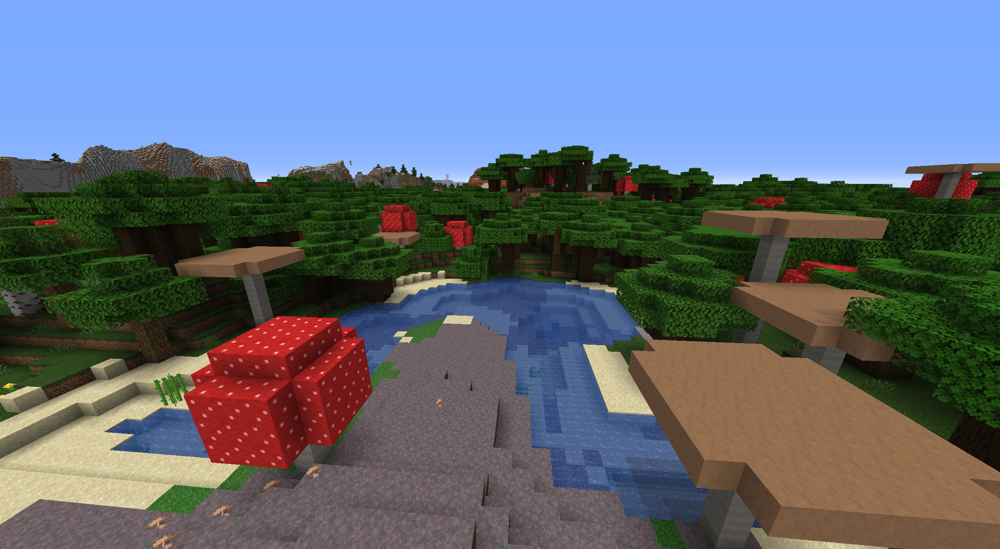

# ImperIUM - Minecraft Server

## MOTD and Icon

## Seed to be used
### `-1909600681984991067`

### The Spawn will be on a Mushroom Biome to avoid Hostile mobs to spawn and to make safer "Capital" of the world.

## Pictures of Spawn

.png "4")
.png "5") 
.png "6") 

## Mods

- [Bluemap](./Mods/Bluemap.md)
- [Carpet](./Mods/Carpet.md)
- [Carpet Extra](./Mods/Carpet_Extra.md)
- [Carpet TIS Addition](./Mods/Carpet_TIS_Extra.md)
- [Chunk Pregenerator](./Mods/Chunk_Pregenerator.md)
- [Leukocyte](./Mods/Leukocyte.md)
- [Lithium](./Mods/Lithium.md)
- [MiniMOTD](./Mods/MiniMOTD.md)
- [Phosphor](./Mods/Phosphor.md)
- [Player Roles](./Mods/PlayerRoles.md)
- [SAX](./Mods/SAX.md)
- [SimpleAuth](./Mods/SimpleAuth.md)
- [Game Start](./Mods/Game_Start.md)

## Datapacks
- Anti Enderman Grief
- Armour Stands
- Cauldron Concrete
- Coordinates HUD
- Custom Nether Portals
- Double Shulker Shells
- Player Head Drops
- More Mob Heads
- Nether Portal Coords
- Silence Mobs
- Track Raw Statistics
- Wandering Trader MicroBlocks

## Crafting Tweaks
- Dropper to Dispenser
- More Trapdoors
- Universal Dyeing
- Unpackable Ice

## Available Commands
- [Commands](./Commands.md)
